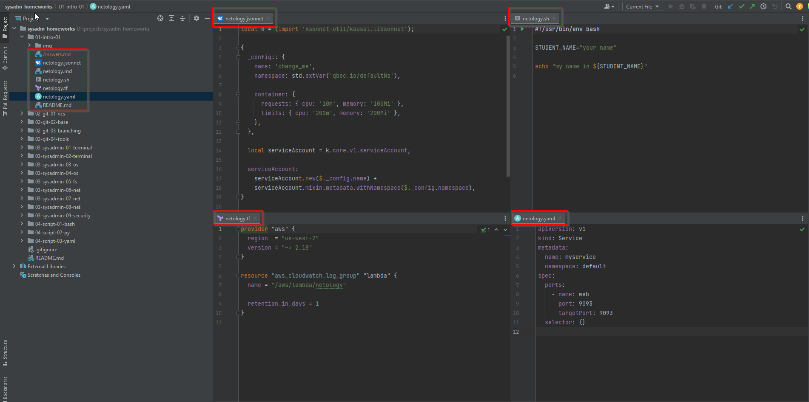

# Домашнее задание к занятию «Введение в DevOps»
     
## Задание 1. Подготовка рабочей среды

Установить плагины:

* Terraform.
* MarkDown.
* Yaml или Ansible Support.
* Jsonnet.

----

## Задание 2. Описание жизненного цикла задачи (разработки нового функционала)
1. Новые требования по доработке интернет-магазина приходят и их много.  
Т.к. это продукт компании и она его развивает, должен быть продукт-менеджер.  
Он составляет список новых задач, оценивает их приоритет и передает в проработку аналитикам.  
Тут на самом деле может еще участвовать архитектор проекта, он оценивает возможность реализации
и дает предварительную оценку работ.
2. Аналитики прорабатывают задачи, создают макеты и подробное описание логики работы новых доработок.  
После этого они попадают в бэклог проекта.  
Далее продукт-менеджер распределяет задачи в спринты разработки.
3. Разработка пишет код. Пишет Unit-тесты к коду. Тимлид команды разработки проводит ревью кода,
одобряет пулл-реквесты по задачам и код попадает в общий репозиторий.
Далее запускаются процессы CI/CD
4. Команда DevOps-инженеров заранее готовит стенды для разработки, тестирования, предпродакшена и продуктива.
Под каждый стенд создается конвейер сборки со сборкой проекта, запуском Unit-тестов,
анализа кода на безопасность, публикацией на стенд для тестирования и запуском тестов на запущенном приложении (интеграционные, DAST)
5. Тестировщики проводят тестирование нового функционала, дописывают автотесты при необходимости
6. Далее задача попадает на предпродакшен, проводятся интеграционные, приемочные тестирования, показы.
7. После прохождения всех этапов тестирования задача попадает на продакшен стенд.
Тут принимают участие DevOps-инженеры и возможно разработчики. 
При возникновении проблем с релизом на продакшен стенд необходимо откатить изменения до предыдущей версии приложения. 

